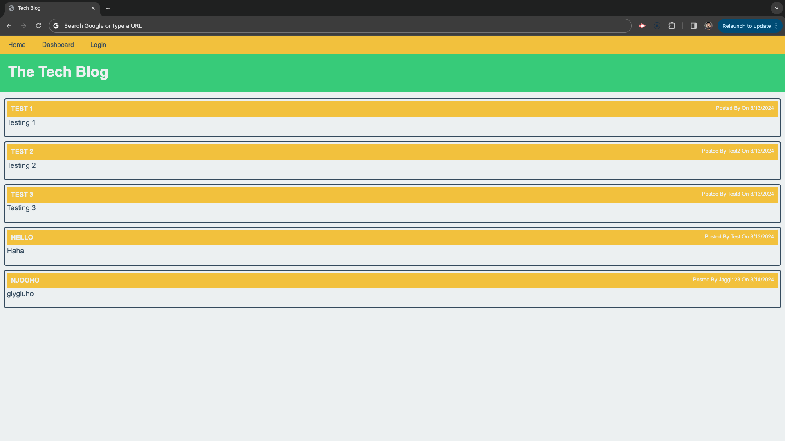

# Tech Blog

## Description
A platform for developers to share blog posts and comment on each other's work.

## Table of Contents

- [Usage](#usage)
- [License](#license)

## Usage

After signing up and/or logging in, you can:
* Add new blog posts
* Edit existing posts
* View and comment on posts from other bloggers

## License

Copyright © 2024 Mandeep Singh

This application is licensed under the terms of the MIT License. You may obtain a copy of the License [here](https://opensource.org/licenses/MIT).